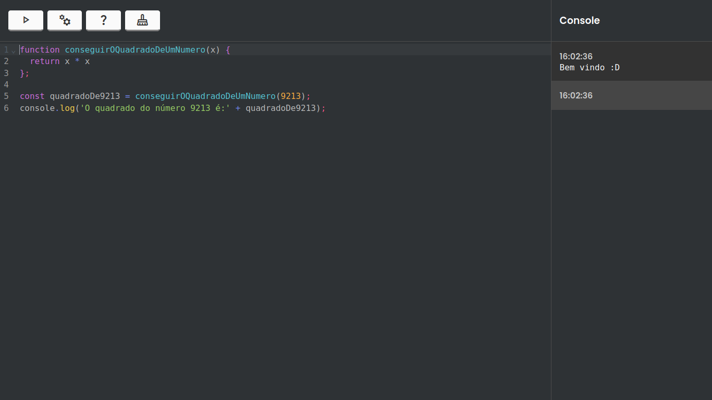
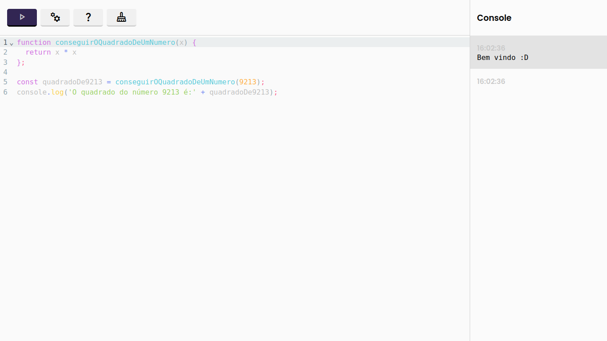

# Guia de uso
## Comandos

### `npm run build`
Controi o projeto para produção no diretorio `/dist`

### `npm run dev`
Inicia um servidor local na porta 4000 em modo de desenvolvimento.

### `npm run preview`
Inicia um servidor local na porta 5000 e serve o conteudo do diretorio `/dist`

# Lista de tecnologias ultilizadas

- HTML
- SCSS
- React
- Typescript

# Imagens do projeto

### Tema escuro

### Tema claro
